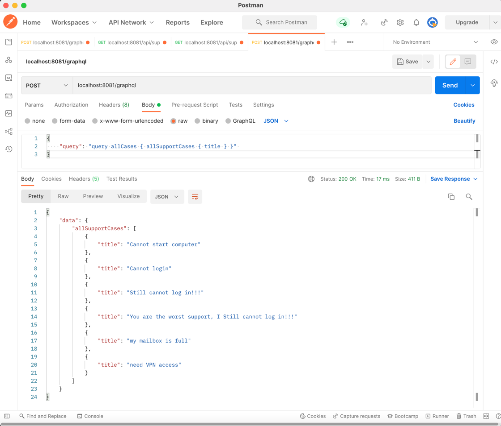
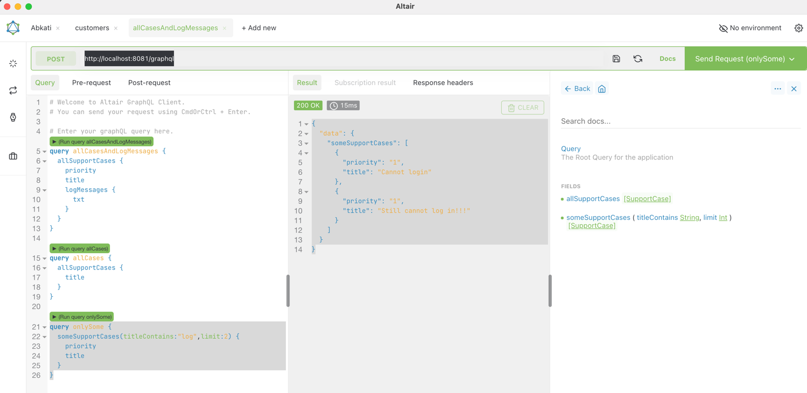

# Simple GraphQL Demo with Spring Boot
## Abstract / What is in the box ?
The goal of this project is to show how easy it is to create a GraphQL application with Spring.
Included is also a number of REST endpoints that does the same job as GraphQL to kind of show the differences
There is also a http client included to show how you would make a REST call.

## REST Endpoints
Comparing REST to Graphql a little, here are some REST endpoints that can do similar things as the GraphQL variant 
(although did not implement sparse fields support)
* GET /api/support-case
* GET /api/support-case/id
* GET /api/support-case/id/log-messages

## GraphQL
The graphql schema looks like this
```
type SupportCase {
    id: ID!
    priority: String!
    title: String!
    text: String!
    logMessages: [LogMessage]
}

type LogMessage {
    id: ID!
    txt: String
}

# The Root Queries
type Query {
    allSupportCases: [SupportCase]
    someSupportCases( titleContains: String, limit: Int): [SupportCase]
}


type Mutation {
    addLogMessage( logMessage: LogMessageInput! ) : LogMessage
}
```

### Sample queries

#### All support cases, but just the title

```
query allCases {
  allSupportCases {
    id
    title
  }
}
```

response :
```
{
  "data": {
    "allSupportCases": [
      {
        "title": "Cannot start computer"
      },
      {
        "title": "Cannot login"
      },
      {
        "title": "Still cannot log in!!!"
      },
      {
        "title": "You are the worst support, I Still cannot log in!!!"
      },
      {
        "title": "my mailbox is full"
      },
      {
        "title": "need VPN access"
      }
    ]
  }
}
```

#### Support Cases with log messages
``` 
query allCasesAndLogMessages {
  allSupportCases {
    priority
    title
    logMessages {
      txt
    }
  }
}
```

response :

```
{
  "data": {
    "allSupportCases": [
      {
        "priority": "1",
        "title": "Cannot start computer",
        "logMessages": [
          {
            "txt": "It is all black"
          }
        ]
      },
      {
        "priority": "1",
        "title": "Cannot login",
        "logMessages": [
          {
            "txt": "there is a spinning wheel ..."
          },
          {
            "txt": "hmmm it has been 35 min and still spinning"
          },
          {
            "txt": "IT HAS BEEN 2 hours, and still not working"
          }
        ]
      },
      {
        "priority": "1",
        "title": "Still cannot log in!!!",
        "logMessages": []
      },
      {
        "priority": "1",
        "title": "You are the worst support, I Still cannot log in!!!",
        "logMessages": []
      },
      {
        "priority": "3",
        "title": "my mailbox is full",
        "logMessages": []
      },
      {
        "priority": "3",
        "title": "need VPN access",
        "logMessages": [
          {
            "txt": "need access to Kreml super secret vault"
          }
        ]
      }
    ]
  }
}
```

#### Filter support cases based on title contains

```
query onlySome {
  someSupportCases(titleContains:"log",limit:2) {
    priority
    title
  }
}
```


response :

```
{
  "data": {
    "someSupportCases": [
      {
        "priority": "1",
        "title": "Cannot login"
      },
      {
        "priority": "1",
        "title": "Still cannot log in!!!"
      }
    ]
  }
}
```

## Mutation Samples

### Add Log Message

```
mutation logMessage {
  addLogMessage(logMessage: {
    belongToCase: "3"
    txt: "this is a new log message"
  }) {
    id
    txt
  }
}
```

## GraphQL Clients
### Postman
https://www.postman.com/

> POST http://localhost:8081/graphql

Header :
>Content-Type : application/json 

Body :
```
{
    "query": "query allCases { allSupportCases { title } }" 
}
```



### Altair
https://altair.sirmuel.design/

This is a really good tool that I highly recommend
just point the URL to : `http://localhost:8081/graphql`


### Making http calls from Java
Here we are using the com.squareup.okhttp3 to make the http queries from java.
```java
public static void main(String[] args) throws IOException, InterruptedException {
        String response = HTTPUtils.get("http://localhost:8081/api/support-case");
        System.out.println(response);
        String graphqlQuery = "{\n" + "    \"query\": \"query allCases { allSupportCases { title } }\" \n" + "}";
        String graphqlResponse = HTTPUtils.post("http://localhost:8081/graphql", graphqlQuery);
        System.out.println(graphqlResponse);
    }
```

## Classes and Design
The Spring Boot application can be found in App.java

The very simple http client application can be found in HttpClient.java

## Building & Running
Well...
Run from within IntelliJ, nothing special to consider

## Monitoring JVM for Performance / Stability
Docker compose file in the docker directory
> docker-compose up

go to localhost:9090 for Prometheus
check that you have data , input a query like "jvm" something and if something is found you have data

go to localhost:3000 for Grafana
Configure Prometheus as DataSource
Import Grafana config : 12900
Voila! you are done!

I followed these instructions https://betterprogramming.pub/how-to-monitor-a-spring-boot-app-with-prometheus-and-grafana-22e2338f97fc

